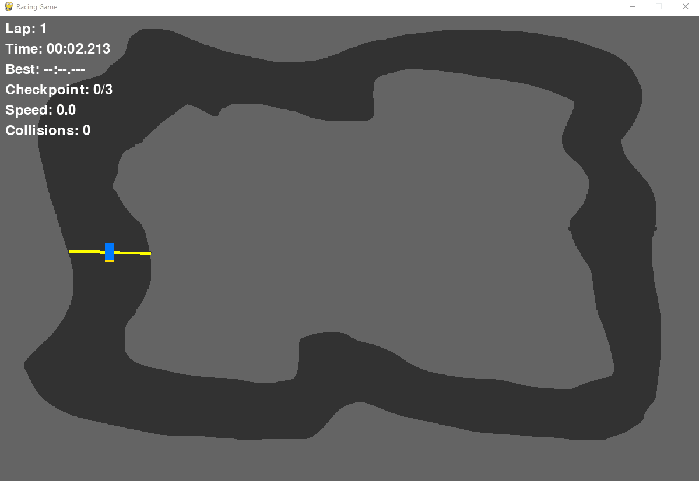
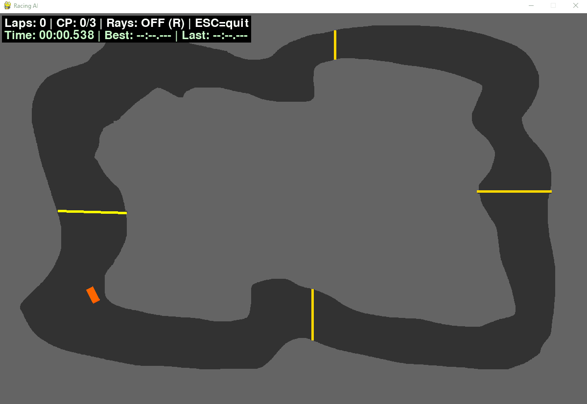
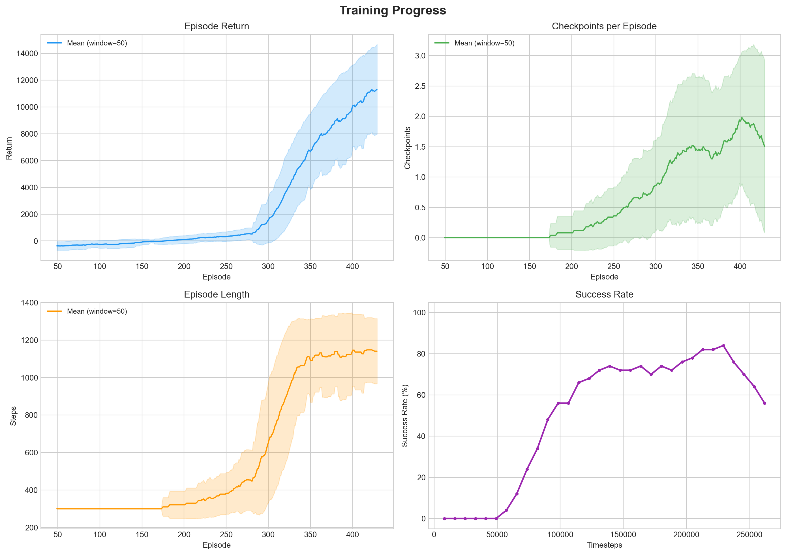
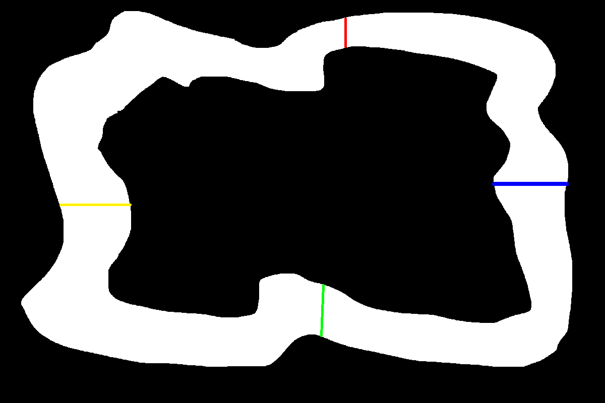

# Racing AI

2D racing game with reinforcement learning. The AI learns to drive using raycast sensors and PPO algorithm.

Repository: [github.com/mewhoosh/racing-ai](https://github.com/mewhoosh/racing-ai)

## Demo

### Manual Play

Play the game yourself using keyboard controls. Press `V` to visualize raycasts - distance sensors that the AI uses to detect walls around the vehicle:



### Trained Agent

Final model (v6, 260k training steps) driving autonomously:



### Training Progress

Visualization of how the agent improves over training (model v3, 210k steps). Video is 2x speed.

[Training progress video](assets/progress.mp4)

Visible learning stages:
- **Early (10-20k steps)** - drives in the wrong direction or stands still
- **Mid (30-50k)** - starts moving forward, reaches first checkpoints
- **Later (70-100k)** - predicts upcoming collisions, reverses before hitting walls
- **Final (150k+)** - completes full laps

### Training Metrics



## Quick Start

```bash
git clone https://github.com/mewhoosh/racing-ai.git
cd racing-ai
pip install -r requirements.txt
```

### Play Manually
```bash
python main.py
```
Controls: `WASD` drive, `V` show raycasts, `C` show checkpoints, `R` reset, `ESC` quit

### Train AI
```bash
python train.py
```
Settings (model version, steps, track) are configured at the top of `train.py`.

### Watch Trained Agent
```bash
python watch.py
```
Agent drives indefinitely. `R` toggles raycasts, `ESC` quits. Model and track paths are configured at the top of `watch.py`.

### Compare Training Progress
```bash
python watch_progress.py
```
Loads all saved checkpoints from a model directory and plays them in order. Press `Enter` to skip to next stage. Configured at the top of `watch_progress.py`.

## How It Works

### Raycasts

The AI perceives the track through 7 raycasts - lines cast from the vehicle at angles from -90° to +90° relative to its heading. Each ray returns a distance to the nearest wall (max range 500px). This gives the agent a simple spatial awareness of the track geometry without any image processing.

### Observations (what AI sees)
- 7 raycast distances (normalized 0-1)
- Current speed (normalized -1 to 1)
- Distance to next checkpoint (normalized 0-1)

### Actions (5 discrete)
| Action | Description |
|--------|-------------|
| 0 | Coast |
| 1 | Accelerate |
| 2 | Accelerate + left |
| 3 | Accelerate + right |
| 4 | Reverse |

### Reward System
| Event | Reward |
|-------|--------|
| Checkpoint crossed | +200 |
| Lap completed | +1000 + time bonus |
| Wall collision | -5 |
| Getting closer to checkpoint | +progress |
| Standing still | -0.2 |

### PPO Algorithm

Training uses Proximal Policy Optimization (PPO) from stable-baselines3. PPO works by collecting batches of experience, then updating the policy network while constraining how much the policy can change per update (clipping). The agent learns a probability distribution over actions for each observation. 8 parallel environments (SubprocVecEnv) are used during training.

## Creating Custom Tracks

Tracks are drawn in MS Paint (or any image editor) and saved as PNG in `tracks/`. Example track used in this project, drawn entirely in Paint:



**Color mapping:**
| Color | RGB | Purpose |
|-------|-----|---------|
| Black | (0,0,0) | Walls |
| White | (255,255,255) | Road |
| Yellow | (255,255,0) | Start/finish line |
| Green | (0,255,0) | Checkpoint 1 |
| Blue | (0,0,255) | Checkpoint 2 |
| Red | (255,0,0) | Checkpoint 3 |

Checkpoints define the order the agent must follow (green -> blue -> red -> finish line). The vehicle spawns at the center of the yellow line, facing downward.

On first load, the entire PNG is scanned pixel by pixel - wall positions, checkpoint lines, and start position are extracted and saved to a JSON cache file (e.g. `track_cache.json`). Subsequent loads read from cache, making startup instant.

## Project Structure

```
├── main.py              # Manual play mode
├── train.py             # PPO training script
├── watch.py             # Watch trained agent drive
├── watch_progress.py    # Compare training stages
├── core/
│   ├── game_engine.py   # Main game loop
│   ├── physics_engine.py # Collision handling
│   ├── renderer.py      # Pygame rendering
│   ├── track.py         # Track data and collision grid
│   ├── track_loader.py  # PNG to JSON conversion
│   └── lap_timer.py     # Lap time tracking
├── entities/
│   ├── vehicle.py       # Base vehicle class (abstract)
│   ├── player_car.py    # Keyboard-controlled vehicle
│   └── ai_car.py        # AI-controlled vehicle
├── ai/
│   └── racing_env.py    # Gymnasium environment
├── tracks/              # Track PNG + JSON cache files
└── models/              # Trained model checkpoints
```

## OOP Design

```
Vehicle (abstract base class)
├── PlayerCar (keyboard input via WASD)
└── AICar (action-driven by RL model)
```

- **Encapsulation** - vehicle internal state (position, speed, angle) is private, accessed through properties and setter methods
- **Inheritance** - PlayerCar and AICar inherit movement, physics and collision logic from Vehicle
- **Polymorphism** - GameEngine, PhysicsEngine and Renderer operate on the Vehicle interface, without knowing the concrete subclass

## Tech Stack

| Library | Version |
|---------|---------|
| pygame | 2.5.2 |
| stable-baselines3 | 2.2.1 |
| gymnasium | 0.29.1 |
| torch | 2.2+ |
| numpy | 1.26.4 |
| matplotlib | 3.8.0 |
| pillow | 10.1.0 |


